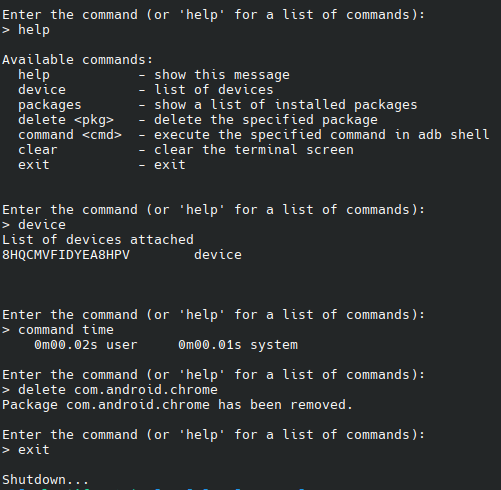

# ADB-Tool

ADB-Tool: Python-based utility for managing Android devices using ADB on Unix-like systems.

## Installation

1. Clone the repository:
    ```bash
    git clone https://github.com/CelestifyX/ADB-Tool.git
    ```

2. Navigate to the project directory:
    ```bash
    cd ADB-Tool
    ```

3. Run `make install` to install ADB-Tool:
    ```bash
    make install
    ```

## Usage

- Run `adb-tool` to manage your Android device.

## Screenshots


